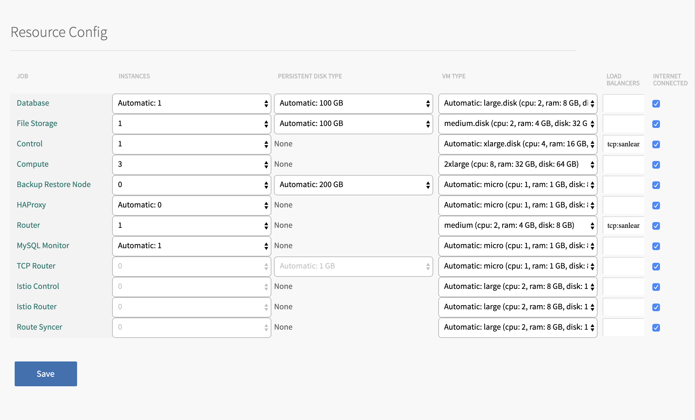

# Load Testing

## Pre-Requisites for Load Testing
- If possible, use a PAS Tile, instead of the Small Footprint PAS tile.
- Scale up the `Router` to be able to accept incoming traffic:
  - This is easily done via the PAS tile in ops-manager.
  - In the PAS Tile under `Resource Config > Route` select `medium` or larger
- Ensure your DIEGO Comput VMs are large enough (ie. at least `2xlarge` for any meaningfull traffic). 
  - This is easily done via the PAS tile in ops-manager.
  - In the PAS Tile under `Resource Config > Compute` select 2xLarge or larger
  - In the PAS Tile under `Resource Config > Compute` increase the amount of instances to 3 (this will help balance your traffic across different VM and network adapters)
  
- Ensure your org has a large memory quota. You will have to scale your app containers, and at the time of writing CPU and Memory are bound together (so you'll have to give your apps at least 4GB of RAM memory). 
  - To update the `default` quota, run: `cf update-quota default -i 4G -m 40G`

When running `perform_load_test_as_bosh_deployment.sh` or `perform_load_test_locally.sh` the script will scale up the app horizontally to 6 instances and ensure it's provisioned correctly (2GB of RAM memory). It will then run a 5 minute, sustained load test of roughly 400 requests a second.